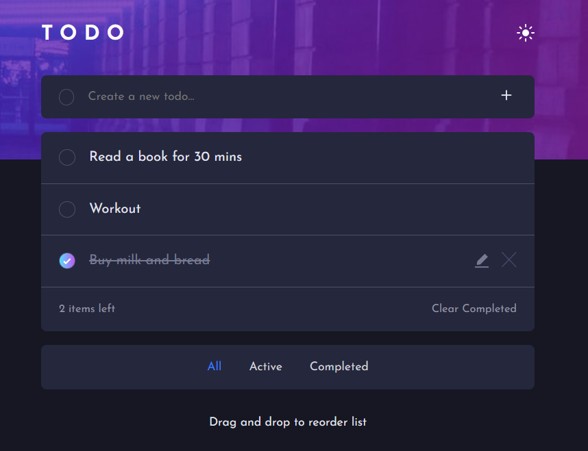
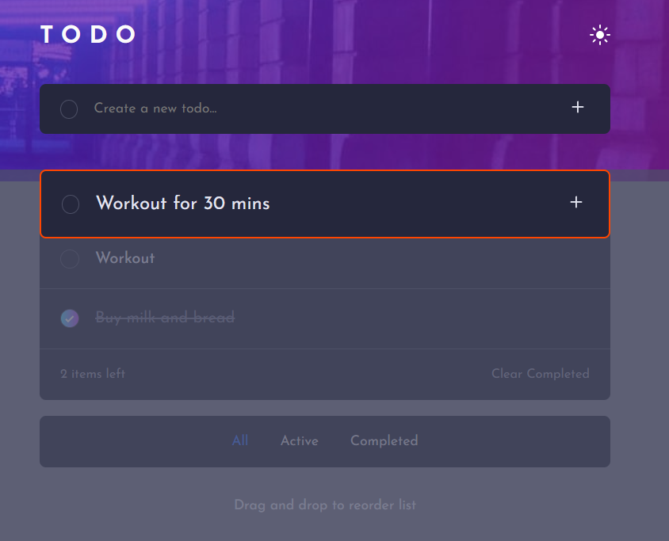
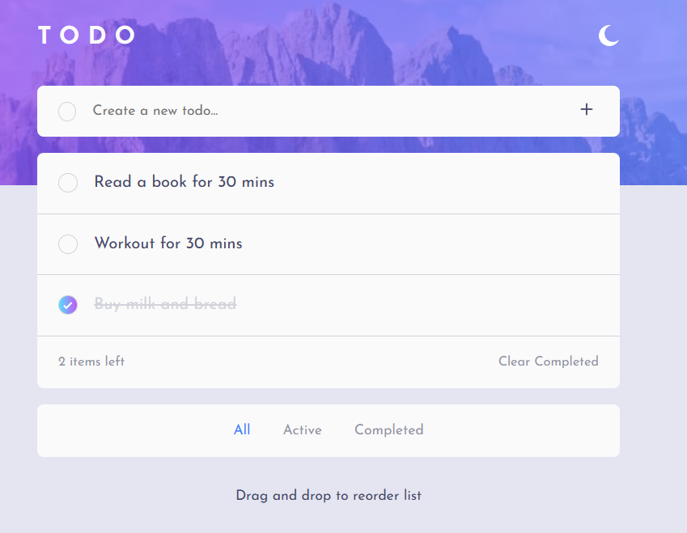

# Frontend Mentor - Todo app solution

This is a solution to the [Todo app challenge on Frontend Mentor](https://www.frontendmentor.io/challenges/todo-app-Su1_KokOW). Frontend Mentor challenges help you improve your coding skills by building realistic projects. 

## Table of contents

- [Overview](#overview)
  - [The challenge](#the-challenge)
  - [Screenshot](#screenshot)
  - [Links](#links)
- [My process](#my-process)
  - [Built with](#built-with)
  - [Useful resources](#useful-resources)
- [Author](#author)

## Overview

### The challenge

Users should be able to:

- View the optimal layout for the app depending on their device's screen size
- See hover states for all interactive elements on the page
- Add new todos to the list
- Edit todos in the list
- Mark todos as complete
- Delete todos from the list
- Filter by all/active/complete todos
- Clear all completed todos
- Toggle light and dark mode
- Drag and drop to reorder items on the list

### Screenshot

### Links

- Solution URL: [Git Hub](https://github.com/Kobpong117/fem-todo-app)
- Live Site URL: [kp-fem-todo-app.netlify.app](https://kp-fem-todo-app.netlify.app/)

## My process

### Built with

- Semantic HTML5 markup
- CSS custom properties
- Flexbox
- Mobile-first workflow
- [React](https://reactjs.org/) - JS library

### Useful resources

- [Modern React CRUD App Project](https://www.youtube.com/watch?v=7u2Rv4HfCYQ&t=541s) - This helped me learn how to edit my todo app.
- [Drag and Drop in React](https://www.youtube.com/watch?v=HeNVPF_fRXI&t=1729s) - Dave Grey's youtube channel is a great resource for learning web development. This video teach me how to apply react-beautiful-dnd to my project.

## Author

- Frontend Mentor - [@Kobpong117](https://www.frontendmentor.io/profile/Kobpong117)
